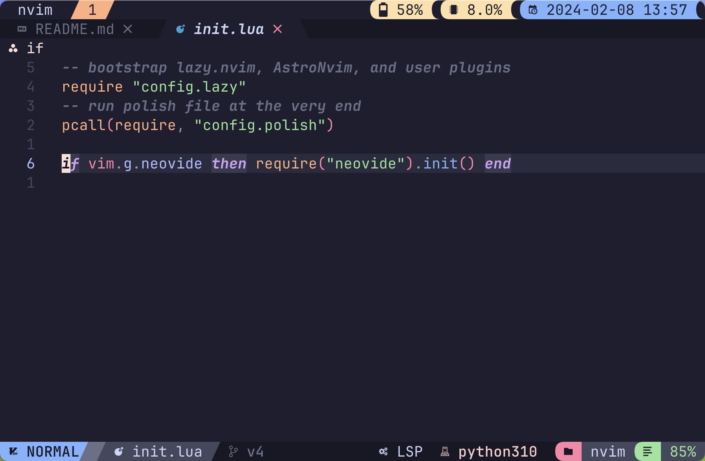
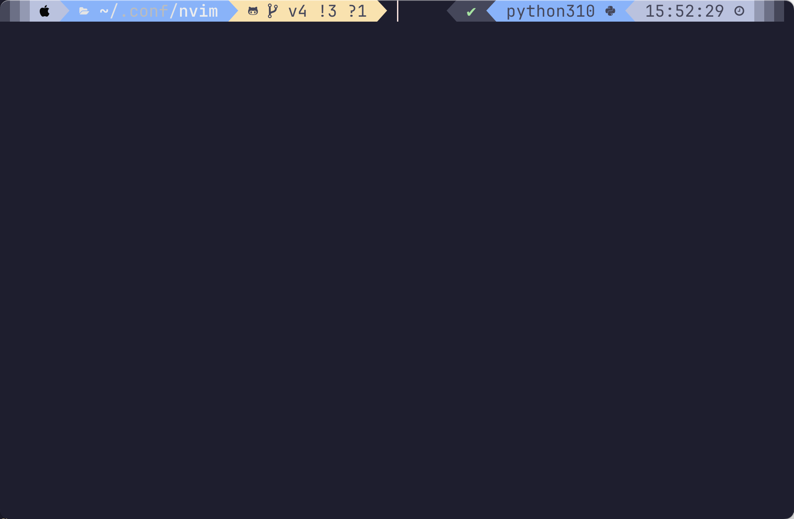
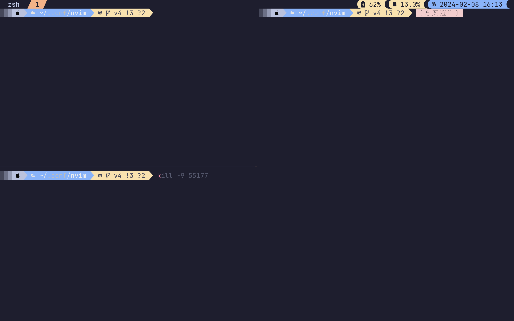
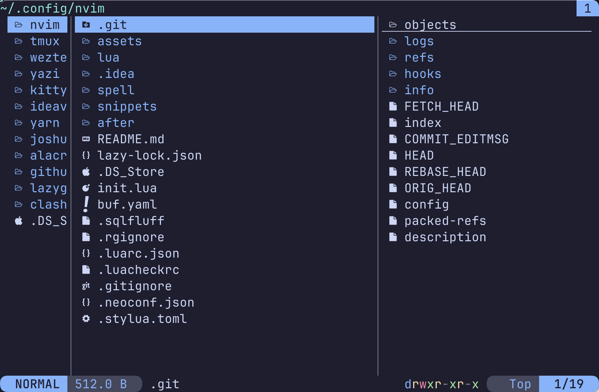
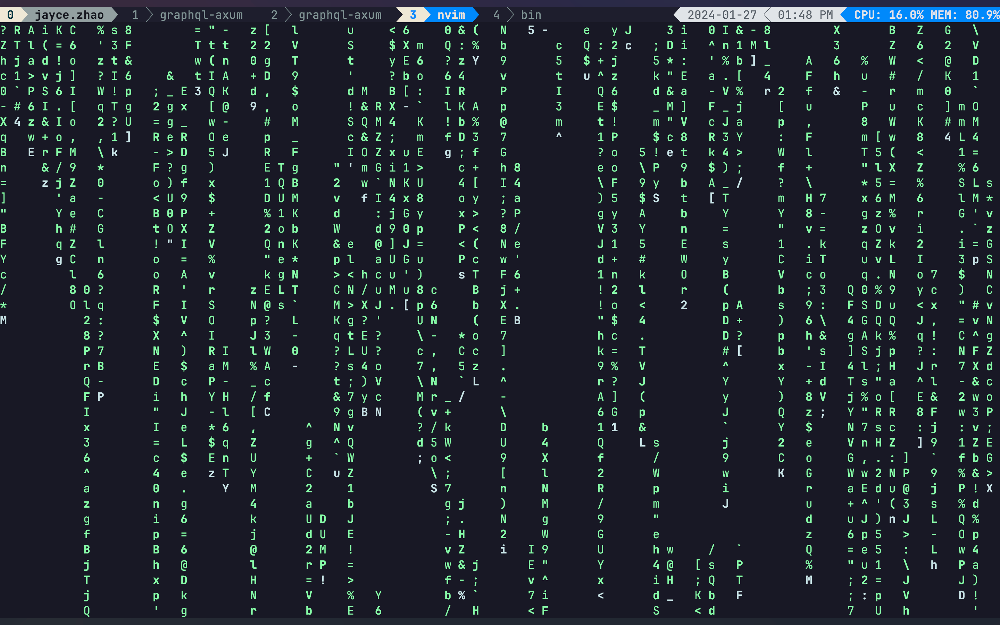

# AstroNvim Template

**NOTE:** This is the latest v4 configuration; everyone can use it with confidence.

hello guys!
in my workflow,I use `wezterm` as my terminal, and I also use `tmux` to provide me with multiple terminal windows, `yazi` as terminal file manager. btw this config support neovide and don't need other configs.

### Support neovim version
neovim >= `0.9`, recommend `0.9`

### Features

now,this config supports development in `TypeScript`,`Python`,`Go`, `Rust` and `markdown`.

- ***`Typescript`***: `typescript-tools.nvim`
- ***`Python`***: `pylance`
- ***`Go`***: `go.nvim` *-- support go zero framework* 
- ***`Markdown`***: `iamcco/markdown-preview.nvim`,
- ***`Rust`***: `mrcjkb/rustaceanvim`


### workflow screenshot
`wezterm` + `tmux` + `astronvim`

 

`wezterm` 

 

`tmux`

 

`yazi`

 

### other components config

`wezterm`: [https://github.com/chaozwn/wezterm]('https://github.com/chaozwn/wezterm') 

`tmux`: [https://github.com/chaozwn/tmux]("https://github.com/chaozwn/tmux")

`yazi`: [https://github.com/chaozwn/yazi]("https://github.com/chaozwn/yazi")
## 🛠️ Installation

#### The system should supports commands.

`npm`,`rustc`,`go`,`tmux` -- if you want to use `tmux-awesome-manager`

#### Recommend install

```shell
brew install fzf
brew install luarocks
brew install lazygit
brew install ripgrep
npm install -g tree-sitter-cli
brew install gdu
brew install bottom
brew install protobuf
```

#### Make a backup of your current nvim and shared folder

```shell
mv ~/.config/nvim ~/.config/nvim.bak
mv ~/.local/share/nvim ~/.local/share/nvim.bak
mv ~/.local/state/nvim ~/.local/state/nvim.bak
mv ~/.cache/nvim ~/.cache/nvim.bak
```

#### Create a new user repository from this template

Press the "Use this template" button above to create a new repository to store your user configuration.

You can also just clone this repository directly if you do not want to track your user configuration in GitHub.

#### Clone the repository

```shell
git clone https://github.com/chaozwn/astronvim_with_coc_or_mason ~/.config/nvim
```

#### Start Neovim

```shell
nvim
```

## Tips
### Use Lazygit
`<leader>tl`

### Install unimatrix
`<Leader>tm`
```shell
pip install git+https://github.com/will8211/unimatrix.git
```
 

### Neovim requirements

```
npm install -g neovim
pip install pynvim
```

### Markdown Image Paste

```shell
pip install pillow
```

### Input Auto Switch

```shell
brew tap daipeihust/tap
brew install im-select
im-select
```
run `im-select` & copy result to `im-select.lua`

```lua
-- update your self input method here
Mac.zhCN = "im.rime.inputmethod.Squirrel.Hans" -- there
Mac.en =  "com.apple.keylayout.ABC"
```

### Support styled-components

```shell
npm i -g @styled/typescript-styled-plugin typescript-styled-plugin
```

### Support for neovide
```
brew install neovide
neovide .
```

### Support Lazydocker
tigger command: `<leader>td`
```shell
brew install lazydocker
```


## General Mappings

| Action                      | Mappings            |
| --------------------------- | ------------------- |
| Leader key                  | `Space`             |
| Resize up                   | `Ctrl + Up`         |
| Resize Down                 | `Ctrl + Down`       |
| Resize Left                 | `Ctrl + Left`       |
| Resize Right                | `Ctrl + Right`      |
| Up Window                   | `Ctrl + k`          |
| Down Window                 | `Ctrl + j`          |
| Left Window                 | `Ctrl + h`          |
| Right Window                | `Ctrl + l`          |
| Force Write                 | `Ctrl + s`          |
| Force Quit                  | `Ctrl + q`          |
| New File                    | `Leader + n`        |
| Close Buffer                | `Leader + c`        |
| Next Tab (real vim tab)     | `]t`                |
| Previous Tab (real vim tab) | `[t`                |
| Comment                     | `Leader + /`        |
| Horizontal Split            | `\`                 |
| Vertical Split              | <code>&#124;</code> |

## NOTE

#### _vim.lsp.buf.hover()_ `KK` jump into signature help float window.

```
Displays hover information about the symbol under the cursor in a floating
window. Calling the function twice will jump into the floating window.
```
